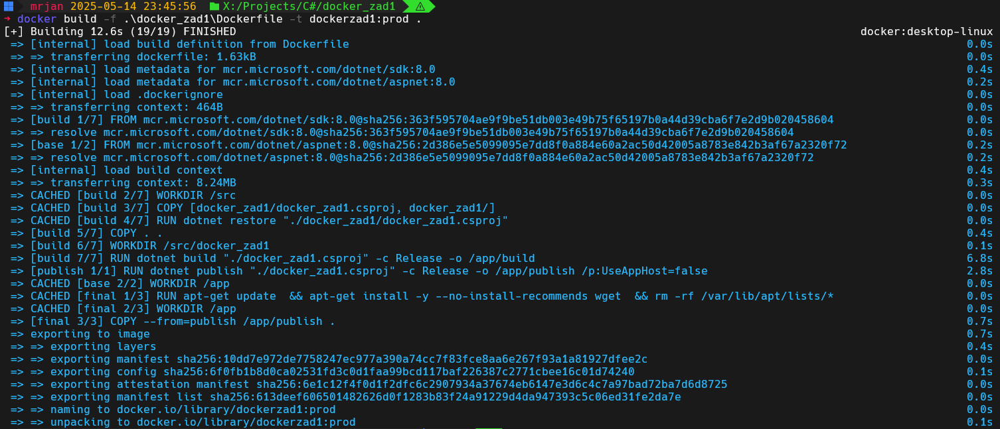
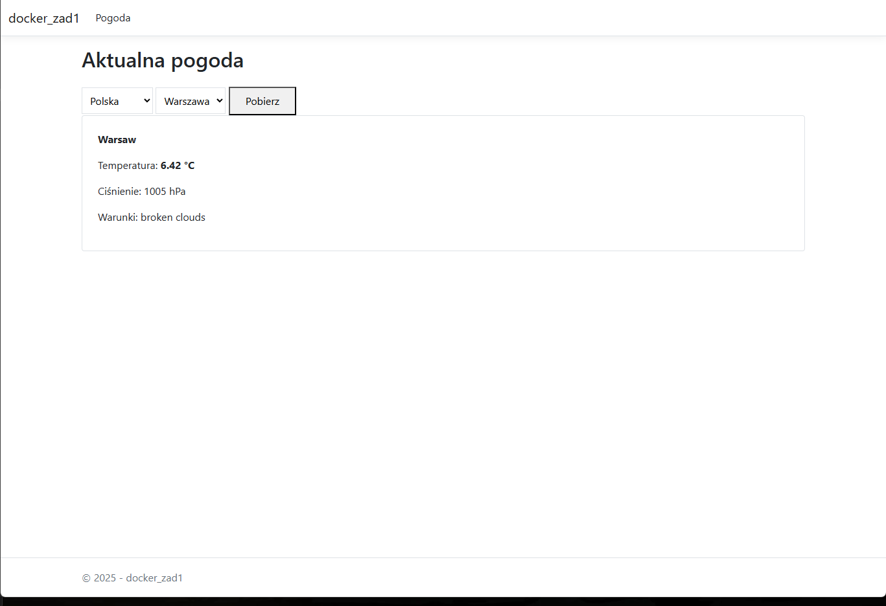
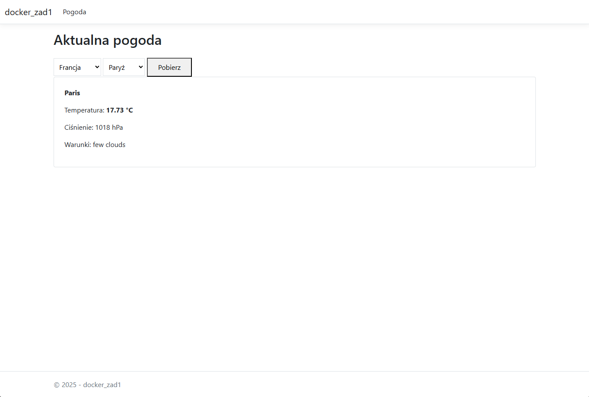

# docker_zad1

# Autor: Jan Ożga
## CZĘŚĆ OBOWIĄZKOWA

## 1. Aplikacja pogodowa
#### Aplikacja została napisana w oparciu o framework ASP.NET CORE
Po uruchomieniu wyświetla w logach:
  - Datę i czas uruchomienia
  - Imię i nazwisko autora
  - Port TCP, na którym nasłuchuje aplikacja  
#### Interfejs webowy umożliwia:
  - Wybór kraju z predefiniowanej listy
  - Wybór miasta w wybranym kraju
  - Wyświetlenie aktualnej pogody(temperatura, ciśnienie, krótki opis warunków pogodowych)
Dane pogodowe są pobierane z API OpenWeatherMap

## 2. Dockerfile
```dockerfile
FROM mcr.microsoft.com/dotnet/aspnet:8.0 AS base
USER app
WORKDIR /app
EXPOSE 8080
EXPOSE 8081

FROM mcr.microsoft.com/dotnet/sdk:8.0 AS build
ARG BUILD_CONFIGURATION=Release
WORKDIR /src
COPY ["docker_zad1/docker_zad1.csproj", "docker_zad1/"]
RUN dotnet restore "./docker_zad1/docker_zad1.csproj"
COPY . .
WORKDIR "/src/docker_zad1"
RUN dotnet build "./docker_zad1.csproj" -c $BUILD_CONFIGURATION -o /app/build

FROM build AS publish
ARG BUILD_CONFIGURATION=Release
RUN dotnet publish "./docker_zad1.csproj" -c $BUILD_CONFIGURATION -o /app/publish /p:UseAppHost=false

FROM base AS final
LABEL org.opencontainers.image.authors="Jan Ożga"
ENV ASPNETCORE_URLS=http://+:8080
USER root
RUN apt-get update \
 && apt-get install -y --no-install-recommends wget \
 && rm -rf /var/lib/apt/lists/*
HEALTHCHECK --interval=30s --timeout=3s --start-period=10s \
        CMD wget --no-verbose --tries=1 --spider http://localhost:8080/ || exit 1
WORKDIR /app
COPY --from=publish /app/publish .
USER app
ENTRYPOINT ["dotnet", "docker_zad1.dll"]
```
## 3. Polecenia

##### a. Zbudowanie obrazu
```bash
docker build -f .\docker_zad1\Dockerfile -t dockerzad1:prod .
```


#### b. Uruchomienie kontenera
```bash
docker run -d --name docker_zad1 -p 8080:8080 -e OpenWeatherMap_ApiKey=<APIKEY> dockerzad1:prod
```


#### c. Uzyskanie informacji z logów
```bash
docker logs docker_zad1
```


#### d. Uzyskanie informacji o warstwach obrazu i jego rozmiarze
```bash
docker history dockerzad1:prod
```

```bash
docker image ls dockerzad1
```


## 4. Zrzuty ekranu pokazujący prawidłowe działanie aplikacji


